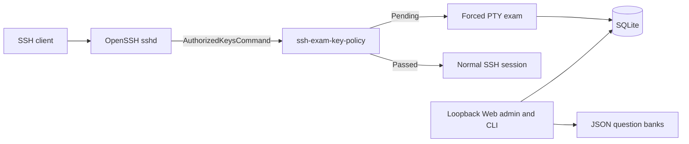

<div align="center">

# SSH Exam Gate

**Require a short knowledge check before selected SSH public keys receive access.**

[English](README.md) | [简体中文](README.zh-CN.md)

[](https://github.com/huluhuluu/ssh-exam/releases)
[](https://github.com/huluhuluu/ssh-exam/actions/workflows/release.yml)
[](LICENSE)
[](https://www.rust-lang.org/)

</div>

SSH Exam Gate sits behind OpenSSH's public-key lookup. A new user receives a
terminal exam; a user who passes reconnects with ordinary OpenSSH behavior.
It is designed for laboratories, GPU servers, bastions, and
other shared Linux environments where users should understand local operating
rules before access is granted.

> [!IMPORTANT]
> Installing or starting SSH Exam Gate does **not** change the live `sshd`.
> Interception begins only after an operator installs, validates, and reloads
> the supplied `Match Group` configuration. Keep a tested recovery account
> outside that group.

## Highlights

- **First-login TUI exam** for selected OpenSSH public-key logins.
- **JSON question-bank import** for host, Docker, network, or general topics.
- **Composable tests:** save multiple drafts, combine banks in a defined order,
  set question limits and shuffle behavior, then publish an immutable revision.
- **Publication history:** inspect and reactivate an earlier test revision
  without rewriting its questions or audit history.
- **Safe administration CRUD:** edit and remove people, unused question banks,
  and unpublished tests with CSRF-protected confirmation controls.
- **Searchable administration:** filter people by account/exam state, banks by
  environment, and tests by publication state from shareable list URLs.
- **Bilingual Web and TUI** with English, Chinese, and bilingual modes.
- **Direct account ownership:** each person owns at most one Unix account, and
  all enabled keys inherit it. Key comments and email-like labels are metadata.
- **Normal SSH after passing:** shell, commands, VS Code, and forwarding remain
  governed by the server's existing `sshd` configuration.
- **Loopback-only admin UI** with Argon2id passwords, CSRF protection, signed
  sessions, and atomic JSON quiz writes.
- **Small Rust binaries** with bundled SQLite and prebuilt Linux x86_64 releases.
- **One-command lifecycle:** verified release install, upgrade, safe uninstall,
  and explicitly confirmed full data purge scripts.

## How It Works



OpenSSH supplies `%u`, `%f`, `%t`, and `%k` to `ssh-exam-key-policy`. The helper
validates the requested Unix account, fingerprint, key type, key blob, person,
and current test revision before it emits an authorized-keys line. It fails
closed.

Pending users receive `restrict,pty` plus a forced `ssh-exam-tui` command.
Passed users receive the registered public key without forced-command or
forwarding restrictions, so the existing `sshd` configuration governs the
connection normally.

> [!WARNING]
> Schema v5 removes the former per-key account rules. During upgrade, a person
> is assigned an old Unix account only when exactly one enabled account is
> present and that account is not shared with another person. Ambiguous records remain
> unassigned and fail closed. Back up the database, run `migrate`, then review
> every unassigned person before reloading OpenSSH.

## Quick Start

Prebuilt installation supports Linux x86_64 with glibc. The installer downloads
the release archive, verifies SHA256, creates service identities and protected
directories, installs examples and sudoers policy, initializes the database and
administrator password, and starts the loopback Web service on systemd hosts.

```sh
curl -fsSL https://github.com/huluhuluu/ssh-exam/releases/latest/download/ssh-exam | sudo sh -s -- --install
```

It prompts twice for the new administrator password through `/dev/tty`, so the
password is never placed in shell history or a command-line argument. Running
the same command again upgrades binaries, applies migrations, and preserves
configuration, authentication material, databases, question banks, people,
keys, attempts, and publication history.

Pin an exact release when repeatability matters:

```sh
VERSION=v0.4.8
curl -fsSL "https://github.com/huluhuluu/ssh-exam/releases/download/${VERSION}/ssh-exam" | sudo sh -s -- --install --release "$VERSION"
```

For Docker or another non-systemd environment, let the container supervisor
own the admin process:

```sh
curl -fsSL https://github.com/huluhuluu/ssh-exam/releases/latest/download/ssh-exam | sudo sh -s -- --install --service-mode none
sudo ssh-exam --serve
```

For unattended provisioning, pass a root-readable regular password file with
`--admin-password-file FILE`, then remove that file immediately. Existing
installations do not read or replace the administrator password.

The unified command deliberately does **not** edit or reload OpenSSH. It installs the
reviewable SSH and sudoers snippets under `/usr/share/doc/ssh-exam/deploy/`.
Complete the isolated test and production activation checklist below before
copying the SSH `Match Group` configuration.

### Open the admin

The admin refuses non-loopback bind addresses. Reach it through an SSH tunnel:

```sh
sudo ssh-exam --start
ssh -p <SSH_PORT> -L 8787:127.0.0.1:8787 recovery-admin@bastion.example.org
```

Open `http://127.0.0.1:8787/`, then:

1. Import or review JSON files under **Question banks**; use list search and
   environment filters as the catalog grows.
2. Create a test, select its question banks with checkboxes, and publish it.
3. Create a person and open the person's detail page; filter people by account
   or exam state during routine administration.
4. Assign the person's existing Unix account and register one or more keys.
5. Reset the current exam on the detail page when another attempt is required.

Creating people and keys does not activate interception by itself. OpenSSH must
also use the supplied `Match Group` configuration for the account.

### Password rotation

```sh
sudo ssh-exam --set-admin-password
sudo ssh-exam --restart
```

The first command prompts twice through `/dev/tty`, atomically replaces the auth
file, and preserves its existing UID/GID; the password never appears in shell
history or process arguments. For unattended rotation, pass
`--admin-password-file /root/admin-password` and remove the file immediately.
For an externally supervised container, restart that container or process rather
than starting a second admin instance.

### Unified management commands

```sh
sudo ssh-exam --upgrade
sudo ssh-exam --migrate
sudo ssh-exam --set-admin-password
sudo ssh-exam --start
sudo ssh-exam --status
sudo ssh-exam --restart
sudo ssh-exam --stop
sudo ssh-exam --serve    # foreground mode for a container supervisor
ssh-exam --isolated --help
ssh-exam --version
```

`--install` already performs first-time initialization. Use `--config`,
`--admin-binary`, or `--run-as` only for custom deployments; `--runtime-dir` and
`--log-file` apply only to non-systemd lifecycle actions. Exactly one primary
action is accepted per invocation. Advanced bank/test automation remains
available through `ssh-exam-admin` subcommands.

### Uninstall or completely purge

First remove the reviewed SSH `Match Group`, validate the complete `sshd`
configuration, and reload SSH. The uninstaller refuses to remove binaries while
standard SSH configuration paths still reference `ssh-exam-key-policy`.

Remove program files while preserving configuration and all runtime data:

```sh
sudo ssh-exam --uninstall
```

Explicitly remove program files, configuration, database, quizzes, service
identities, and project groups:

```sh
sudo ssh-exam --purge --confirm-purge DELETE-SSH-EXAM
```

Release archives contain three Rust binaries, the unified command, its internal
isolated-sshd helper, compatibility installation scripts, generic configuration
and quiz examples, deployment snippets, the license, and both
READMEs. They never contain runtime databases, credentials, SSH keys, logs, or
host-specific configuration.

## Quiz Banks

`quiz_path` is always bank id `legacy`. When `quiz_directory` is configured,
every safe `*.json` filename stem becomes another bank id. For example,
`host-ssh.json` becomes `host-ssh`.

Each bank defines:

- a title and descriptive environment (`host`, `docker`, `network`, `general`);
- one or more multiple-choice questions.

Legacy bank JSON may still contain `pass_threshold_percent` and `max_attempts`;
saved test settings override those values when banks are composed. The Web
Question banks view validates JSON imports, displays questions, supports edits,
and exports normalized JSON. Writes use a same-directory temporary file, sync,
and atomic rename.
The environment field is descriptive; it does not access Docker, provision a
container, or run commands.

## Tests and Publication

A saved test contains a stable ID, title, ordered bank IDs, pass threshold,
attempt limit, optional questions-per-attempt limit, and independent question
and choice shuffle controls. Multiple drafts can coexist and can be edited from
their detail pages. Publishing resolves all bank files into a complete JSON
snapshot stored in SQLite and computes a SHA-256 revision from the test
identity, bank order, policy, and questions.

- Editing a bank or draft does not mutate the active snapshot.
- Publishing changed content activates a new revision and requires a new pass.
- Republishing byte-equivalent content reuses its revision.
- Attempts and passes are recorded against test ID + revision.
- Publication history is immutable; reactivating an earlier revision restores
  passes previously earned for that exact revision.
- Test bank selection uses checkboxes. Existing selections are shown first in
  their saved composition order.

Deletion is deliberately conservative: removing a person cascades only that
person's keys and exam records; a question bank referenced by any saved test
cannot be removed; active tests and tests with publication history cannot be
deleted.

Useful non-interactive operations:

```sh
ssh-exam-admin import-bank --config /etc/ssh-exam/config.json \
  --id host-ssh --file ./host-ssh.json
ssh-exam-admin list-banks --config /etc/ssh-exam/config.json
ssh-exam-admin create-test --config /etc/ssh-exam/config.json \
  --id onboarding --title 'Server onboarding' \
  --banks host-ssh,docker-ssh --pass-threshold 80 --max-attempts 3 \
  --question-limit 20 --shuffle-questions true --shuffle-choices true
ssh-exam-admin list-tests --config /etc/ssh-exam/config.json
ssh-exam-admin publish-test --config /etc/ssh-exam/config.json --id onboarding
ssh-exam-admin list-publications --config /etc/ssh-exam/config.json --id onboarding
ssh-exam-admin activate-publication --config /etc/ssh-exam/config.json \
  --id onboarding --publication-id <PUBLICATION_ID>
ssh-exam-admin show-published-test --config /etc/ssh-exam/config.json
```

## Test Before Production

Use the unified command before changing the system daemon. It creates a separate
`sshd` under a caller-owned runtime directory and requires an explicit unused
port. The command delegates with `exec`, so it adds no resident wrapper process,
and it never edits or reloads the live SSH configuration.

```sh
ssh-exam --isolated dry-run \
  --runtime-dir <RUNTIME_DIR> \
  --port <TEST_PORT> \
  --test-user <UNIX_USER> \
  --app-config /etc/ssh-exam/config.json \
  --policy-binary /usr/local/libexec/ssh-exam-key-policy \
  --command-user ssh-exam-key

sudo ssh-exam --isolated background \
  --runtime-dir <RUNTIME_DIR> \
  --port <TEST_PORT> \
  --test-user <UNIX_USER> \
  --app-config /etc/ssh-exam/config.json \
  --policy-binary /usr/local/libexec/ssh-exam-key-policy \
  --command-user ssh-exam-key

ssh -p <TEST_PORT> -t <UNIX_USER>@127.0.0.1
sudo ssh-exam --isolated stop --runtime-dir <RUNTIME_DIR>
sudo ssh-exam --isolated cleanup --runtime-dir <RUNTIME_DIR>
```

In Docker, a listener inside the container is not automatically reachable from
another machine. Publish the test port deliberately or reach it through an SSH
tunnel.

## Production Activation

<details>
<summary>Recommended file ownership and permissions</summary>

```text
/usr/local/libexec/ssh-exam-key-policy   root:root                  0755
/usr/local/libexec/ssh-exam-tui          root:root                  0755
/usr/local/sbin/ssh-exam-admin           root:root                  0755
/etc/ssh-exam/config.json                root:root                  0644
/etc/ssh-exam/admin-auth.json            ssh-exam-admin:root        0600
/var/lib/ssh-exam                        ssh-exam-admin:ssh-exam-db  2770
/var/lib/ssh-exam/quiz.json              ssh-exam-admin:ssh-exam-db 0640
/var/lib/ssh-exam/banks/*.json           ssh-exam-admin:ssh-exam-db 0640
/var/lib/ssh-exam/gate.db                ssh-exam-admin:ssh-exam-db 0660
```

The policy identity needs read access to the database and future WAL/SHM files.
The TUI and admin need database write access. Only the admin needs create/rename
access to quiz files. Do not grant these identities Docker socket access or
Docker group membership.

</details>

<details>
<summary>OpenSSH activation checklist</summary>

1. Keep a recovery session open and verify a second recovery login on the real
   SSH port. Keep recovery accounts outside `ssh-exam-gated`.
2. Run the installer, then review its installed deployment snippets. Revalidate
   the sudoers rule with `visudo -cf /etc/sudoers.d/ssh-exam`.
3. Register a disposable person with its Unix account and key; import banks and
   publish a disposable test through the admin.
4. Complete the isolated test workflow with the production application config.
5. Add only intended accounts to `ssh-exam-gated` and install the reviewed
   `deploy/sshd_config.snippet`.
6. Validate the complete configuration with `/usr/sbin/sshd -t` and inspect the
   match with `sshd -T -C user=<ACCOUNT>,host=bastion.example.org,addr=<CLIENT_IP>`.
7. Reload, do not restart, system SSH. Test recovery first and gated access
   second while the original recovery session remains open.

The gate does not configure `Port` or `ListenAddress`. It works on any SSH
listener where the `Match Group` and `AuthorizedKeysCommand` are effective.

</details>

<details>
<summary>Rollback</summary>

From the open recovery session, remove affected users from `ssh-exam-gated` or
remove the gate `Match` block. Validate the complete configuration with
`sshd -t`, then reload SSH. Existing `AuthorizedKeysFile` behavior resumes when
the match no longer applies.

</details>

## VS Code Remote-SSH

VS Code normally starts non-PTY exec channels and should not be expected to
render the first-login TUI. Enroll once in a real terminal:

```sh
ssh -p <SSH_PORT> -t person-account@bastion.example.org
# Complete the exam; the connection closes.
```

After passing, reconnect with VS Code normally.

## Security Model

- Identity is the requested Unix account plus the SHA256 fingerprint of the
  presented public key. Key comments and email addresses are not identity.
- Policy output is emitted only when the person and key are enabled and the
  requested Unix account exactly matches the person's assigned account.
- The admin is loopback-only and uses Argon2id, failed-login throttling, signed
  HttpOnly cookies, CSRF tokens, and one-time signed flash messages.
- Pass state belongs to the person and the immutable test revision. All enabled
  keys for that person inherit the pass only while that revision remains active.
- Keep a recovery account outside the gated group. The gate fails closed, so a
  broken database path or permission can deny gated public-key logins.

## Build and Verify

Use current stable Rust and the committed lockfile:

```sh
cargo fmt --all -- --check
cargo clippy --all-targets --all-features --locked -- -D warnings
cargo test --locked
cargo build --release --locked --bins
./scripts/validate-sshd.sh
visudo -cf deploy/sudoers.snippet
```

`scripts/pty-smoke.py` validates terminal startup and cleanup.
`scripts/benchmark-key-policy.py` reports policy median and p95 latency.

## Troubleshooting

| Symptom | Check |
|---|---|
| A normal session appears before the exam | Effective `Match Group`, group membership, assigned Unix account, person pass state, and `%u/%f/%t/%k` command arguments |
| Public key is denied | Registered fingerprint and key material, enabled flags, database permissions, and fail-closed errors in SSH logs |
| TUI does not appear in VS Code | Complete enrollment with `ssh -t` in a real terminal |
| Test port works only inside Docker | Publish the port or forward it through an existing SSH connection |
| Admin is unreachable | Keep it on loopback and use `ssh -L`; do not bind it publicly |
| Quiz updates fail | Quiz paths must be regular files; the admin needs write and same-directory create/rename permission |

## License

[MIT](LICENSE)
