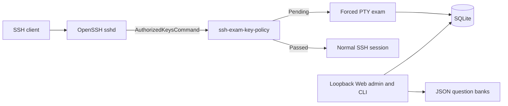

<div align="center">

# SSH Exam Gate

**Require a short knowledge check before selected SSH public keys receive access.**

[English](README.md) | [简体中文](README.zh-CN.md)

[](https://github.com/huluhuluu/ssh-exam/releases)
[](https://github.com/huluhuluu/ssh-exam/actions/workflows/release.yml)
[](LICENSE)
[](https://www.rust-lang.org/)

</div>

SSH Exam Gate sits behind OpenSSH's public-key lookup. A new user receives a
terminal exam; a user who passes reconnects with ordinary OpenSSH behavior.
It is designed for laboratories, GPU servers, bastions, and
other shared Linux environments where users should understand local operating
rules before access is granted.

> [!IMPORTANT]
> Installing or starting SSH Exam Gate does **not** change the live `sshd`.
> Interception begins only after an operator installs, validates, and reloads
> the supplied `Match Group` configuration. Keep a tested recovery account
> outside that group.

## Highlights

- **First-login TUI exam** for selected OpenSSH public-key logins.
- **JSON question-bank import** for host, Docker, network, or general topics.
- **Composable tests:** save multiple drafts, combine banks in a defined order,
  and publish one immutable active revision.
- **Bilingual Web and TUI** with English, Chinese, and bilingual modes.
- **Key-based identity** using Unix account + SHA256 fingerprint; key comments
  and email-like labels are metadata only.
- **Normal SSH after passing:** shell, commands, VS Code, and forwarding remain
  governed by the server's existing `sshd` configuration.
- **Loopback-only admin UI** with Argon2id passwords, CSRF protection, signed
  sessions, and atomic JSON quiz writes.
- **Small Rust binaries** with bundled SQLite and prebuilt Linux x86_64 releases.

## How It Works



OpenSSH supplies `%u`, `%f`, `%t`, and `%k` to `ssh-exam-key-policy`. The helper
validates the requested Unix account, fingerprint, key type, key blob, person,
Access mapping, and current test revision before it emits an authorized-keys
line. It fails closed.

Pending users receive `restrict,pty` plus a forced `ssh-exam-tui` command.
Passed users receive the registered public key without forced-command or
forwarding restrictions, so the existing `sshd` configuration governs the
connection normally.

> [!WARNING]
> Upgrading from `v0.2.x` intentionally converts every former forwarding-only
> mapping into a normal mapping. Those users can receive shell, command, SFTP,
> VS Code, and forwarding capabilities allowed by `sshd` and the Unix account.
> Review old ProxyJump mappings before deploying `v0.3.x`.

> [!NOTE]
> Schema v4 removes question-bank selection from Access mappings. One globally
> published test revision applies to every gated person. Publishing changed
> content requires users to pass the new revision; republishing identical
> content keeps the same revision and existing passes.

## Quick Start

### 1. Download a release

Prebuilt releases target Linux x86_64 with glibc. Build from source for other
architectures or incompatible glibc versions.

```sh
VERSION=v0.4.0
curl -fLO "https://github.com/huluhuluu/ssh-exam/releases/download/${VERSION}/ssh-exam-${VERSION}-linux-x86_64.tar.gz"
curl -fLO "https://github.com/huluhuluu/ssh-exam/releases/download/${VERSION}/SHA256SUMS"
sha256sum -c SHA256SUMS
tar -xzf "ssh-exam-${VERSION}-linux-x86_64.tar.gz"
```

The archive contains three binaries, generic configuration and quiz examples,
deployment snippets, the license, and both READMEs. It contains no runtime
database, credentials, SSH keys, logs, or host-specific configuration.

### 2. Prepare configuration

Install the binaries and copy the examples to operator-owned locations:

```text
ssh-exam-key-policy  OpenSSH read-only policy helper
ssh-exam-tui         forced terminal exam
ssh-exam-admin       database migration and loopback Web admin
```

Edit `config.example.json` and replace every example path. `quiz_path` is the
backwards-compatible `legacy` bank. Set `quiz_directory` to enable additional
`*.json` banks.

### 3. Initialize the database and administrator password

The plaintext password is read from standard input, never from a command-line
argument. `init` creates the database, applies migrations, publishes the
backwards-compatible `legacy` test, generates a random session secret, and
atomically writes `admin-auth.json` with mode `0600` on Unix.

```sh
read -rsp 'Admin password: ' ADMIN_PASSWORD
printf '\n'
printf '%s' "$ADMIN_PASSWORD" | \
  /usr/local/sbin/ssh-exam-admin init --config /etc/ssh-exam/config.json
unset ADMIN_PASSWORD
```

Rotate only the administrator password while preserving the session secret:

```sh
read -rsp 'New admin password: ' ADMIN_PASSWORD
printf '\n'
printf '%s' "$ADMIN_PASSWORD" | \
  /usr/local/sbin/ssh-exam-admin set-admin-password \
  --config /etc/ssh-exam/config.json
unset ADMIN_PASSWORD
```

Never deploy `examples/admin-auth.example.json`; its public placeholder values
are unsafe. Restart the admin service after rotating the password.

### 4. Initialize and open the admin

```sh
sudo -u ssh-exam-admin /usr/local/sbin/ssh-exam-admin serve \
  --config /etc/ssh-exam/config.json
```

For an existing installation, run `migrate --config ...` once before starting
the new binary. Fresh installations already migrate during `init`.

The admin refuses non-loopback bind addresses. Reach it through an SSH tunnel:

```sh
ssh -p <SSH_PORT> -L 8787:127.0.0.1:8787 \
  recovery-admin@bastion.example.org
```

Open `http://127.0.0.1:8787/`, then:

1. Import or review JSON files under **Question banks**.
2. Create a test, list its bank IDs in composition order, and publish it.
3. Create a person and open the person's detail page.
4. Register one or more public keys and map them to an existing Unix account.
5. Reset the current exam on the detail page when another attempt is required.

Creating a person or mapping still does not activate OpenSSH interception.

## Quiz Banks

`quiz_path` is always bank id `legacy`. When `quiz_directory` is configured,
every safe `*.json` filename stem becomes another bank id. For example,
`host-ssh.json` becomes `host-ssh`.

Each bank defines:

- a title and descriptive environment (`host`, `docker`, `network`, `general`);
- one or more multiple-choice questions.

Legacy bank JSON may still contain `pass_threshold_percent` and `max_attempts`;
saved test settings override those values when banks are composed. The Web
Question banks view validates JSON imports, displays questions, supports edits,
and exports normalized JSON. Writes use a same-directory temporary file, sync,
and atomic rename.
The environment field is descriptive; it does not access Docker, provision a
container, or run commands.

## Tests and Publication

A saved test contains a stable ID, title, ordered bank IDs, pass threshold, and
attempt limit. Multiple draft tests can coexist. Publishing resolves all bank
files into a complete JSON snapshot stored in SQLite and computes a SHA-256
revision from the test identity, bank order, policy, and questions.

- Editing a bank or draft does not mutate the active snapshot.
- Publishing changed content activates a new revision and requires a new pass.
- Republishing byte-equivalent content reuses its revision.
- Attempts and passes are recorded against test ID + revision.

Useful non-interactive operations:

```sh
ssh-exam-admin import-bank --config /etc/ssh-exam/config.json \
  --id host-ssh --file ./host-ssh.json
ssh-exam-admin list-banks --config /etc/ssh-exam/config.json
ssh-exam-admin create-test --config /etc/ssh-exam/config.json \
  --id onboarding --title 'Server onboarding' \
  --banks host-ssh,docker-ssh --pass-threshold 80 --max-attempts 3
ssh-exam-admin list-tests --config /etc/ssh-exam/config.json
ssh-exam-admin publish-test --config /etc/ssh-exam/config.json --id onboarding
ssh-exam-admin show-published-test --config /etc/ssh-exam/config.json
```

## Test Before Production

Use the isolated runner before changing the system daemon. It creates a separate
`sshd` under a caller-owned runtime directory and requires an explicit unused
port. It never edits or reloads the live SSH configuration.

```sh
./scripts/isolated-sshd.sh dry-run \
  --runtime-dir <RUNTIME_DIR> \
  --port <TEST_PORT> \
  --test-user <UNIX_USER> \
  --app-config /etc/ssh-exam/config.json \
  --policy-binary /usr/local/libexec/ssh-exam-key-policy \
  --command-user ssh-exam-key

sudo ./scripts/isolated-sshd.sh background \
  --runtime-dir <RUNTIME_DIR> \
  --port <TEST_PORT> \
  --test-user <UNIX_USER> \
  --app-config /etc/ssh-exam/config.json \
  --policy-binary /usr/local/libexec/ssh-exam-key-policy \
  --command-user ssh-exam-key

ssh -p <TEST_PORT> -t <UNIX_USER>@127.0.0.1
sudo ./scripts/isolated-sshd.sh stop --runtime-dir <RUNTIME_DIR>
sudo ./scripts/isolated-sshd.sh cleanup --runtime-dir <RUNTIME_DIR>
```

In Docker, a listener inside the container is not automatically reachable from
another machine. Publish the test port deliberately or reach it through an SSH
tunnel.

## Production Activation

<details>
<summary>Recommended file ownership and permissions</summary>

```text
/usr/local/libexec/ssh-exam-key-policy   root:root                  0755
/usr/local/libexec/ssh-exam-tui          root:root                  0755
/usr/local/sbin/ssh-exam-admin           root:root                  0755
/etc/ssh-exam/config.json                root:root                  0644
/etc/ssh-exam/admin-auth.json            ssh-exam-admin:root        0600
/var/lib/ssh-exam                        ssh-exam-admin:ssh-exam-db  2770
/var/lib/ssh-exam/quiz.json              ssh-exam-admin:ssh-exam-db 0640
/var/lib/ssh-exam/banks/*.json           ssh-exam-admin:ssh-exam-db 0640
/var/lib/ssh-exam/gate.db                ssh-exam-admin:ssh-exam-db 0660
```

The policy identity needs read access to the database and future WAL/SHM files.
The TUI and admin need database write access. Only the admin needs create/rename
access to quiz files. Do not grant these identities Docker socket access or
Docker group membership.

</details>

<details>
<summary>OpenSSH activation checklist</summary>

1. Keep a recovery session open and verify a second recovery login on the real
   SSH port. Keep recovery accounts outside `ssh-exam-gated`.
2. Install the binaries, service identities, configuration, state permissions,
   and reviewed sudoers rule. Validate it with
   `visudo -cf deploy/sudoers.snippet`.
3. Register a disposable person, key, and mapping; import banks and publish a
   disposable test through the admin.
4. Complete the isolated test workflow with the production application config.
5. Add only intended accounts to `ssh-exam-gated` and install the reviewed
   `deploy/sshd_config.snippet`.
6. Validate the complete configuration with `/usr/sbin/sshd -t` and inspect the
   match with `sshd -T -C user=<ACCOUNT>,host=bastion.example.org,addr=<CLIENT_IP>`.
7. Reload, do not restart, system SSH. Test recovery first and gated access
   second while the original recovery session remains open.

The gate does not configure `Port` or `ListenAddress`. It works on any SSH
listener where the `Match Group` and `AuthorizedKeysCommand` are effective.

</details>

<details>
<summary>Rollback</summary>

From the open recovery session, remove affected users from `ssh-exam-gated` or
remove the gate `Match` block. Validate the complete configuration with
`sshd -t`, then reload SSH. Existing `AuthorizedKeysFile` behavior resumes when
the match no longer applies.

</details>

## VS Code Remote-SSH

VS Code normally starts non-PTY exec channels and should not be expected to
render the first-login TUI. Enroll once in a real terminal:

```sh
ssh -p <SSH_PORT> -t person-account@bastion.example.org
# Complete the exam; the connection closes.
```

After passing, reconnect with VS Code normally.

## Security Model

- Identity is the requested Unix account plus the SHA256 fingerprint of the
  presented public key. Key comments and email addresses are not identity.
- Policy output is emitted only for enabled people, keys, and mappings.
- The admin is loopback-only and uses Argon2id, failed-login throttling, signed
  HttpOnly cookies, CSRF tokens, and one-time signed flash messages.
- An Access mapping may apply to every registered key for a person or to one
  selected device key.
- Pass state belongs to the person and the immutable test revision. All enabled
  keys and mappings for that person inherit the pass only while that revision
  remains active.
- Keep a recovery account outside the gated group. The gate fails closed, so a
  broken database path or permission can deny gated public-key logins.

## Build and Verify

Use current stable Rust and the committed lockfile:

```sh
cargo fmt --all -- --check
cargo clippy --all-targets --all-features --locked -- -D warnings
cargo test --locked
cargo build --release --locked --bins
./scripts/validate-sshd.sh
visudo -cf deploy/sudoers.snippet
```

`scripts/pty-smoke.py` validates terminal startup and cleanup.
`scripts/benchmark-key-policy.py` reports policy median and p95 latency.

## Troubleshooting

| Symptom | Check |
|---|---|
| A normal session appears before the exam | Effective `Match Group`, group membership, mapping, person pass state, and `%u/%f/%t/%k` command arguments |
| Public key is denied | Registered fingerprint and key material, enabled flags, database permissions, and fail-closed errors in SSH logs |
| TUI does not appear in VS Code | Complete enrollment with `ssh -t` in a real terminal |
| Test port works only inside Docker | Publish the port or forward it through an existing SSH connection |
| Admin is unreachable | Keep it on loopback and use `ssh -L`; do not bind it publicly |
| Quiz updates fail | Quiz paths must be regular files; the admin needs write and same-directory create/rename permission |

## License

[MIT](LICENSE)
