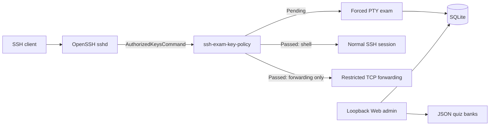

<div align="center">

# SSH Exam Gate

**Require a short knowledge check before selected SSH public keys receive access.**

[English](README.md) | [简体中文](README.zh-CN.md)

[](https://github.com/huluhuluu/ssh-exam/releases)
[](https://github.com/huluhuluu/ssh-exam/actions/workflows/release.yml)
[](LICENSE)
[](https://www.rust-lang.org/)

</div>

SSH Exam Gate sits behind OpenSSH's public-key lookup. A new user receives a
terminal exam; a user who passes receives the access profile assigned by an
administrator. It is designed for laboratories, GPU servers, bastions, and
other shared Linux environments where users should understand local operating
rules before access is granted.

> [!IMPORTANT]
> Installing or starting SSH Exam Gate does **not** change the live `sshd`.
> Interception begins only after an operator installs, validates, and reloads
> the supplied `Match Group` configuration. Keep a tested recovery account
> outside that group.

## Highlights

- **First-login TUI exam** for selected OpenSSH public-key logins.
- **Multi-file quiz banks** for host, Docker, network, or general topics.
- **Bilingual Web and TUI** with English, Chinese, and bilingual modes.
- **Key-based identity** using Unix account + SHA256 fingerprint; key comments
  and email-like labels are metadata only.
- **Two post-pass access profiles:** normal SSH or tightly scoped forwarding.
- **Loopback-only admin UI** with Argon2id passwords, CSRF protection, signed
  sessions, and atomic JSON quiz writes.
- **Small Rust binaries** with bundled SQLite and prebuilt Linux x86_64 releases.

## How It Works



OpenSSH supplies `%u`, `%f`, `%t`, and `%k` to `ssh-exam-key-policy`. The helper
validates the requested Unix account, fingerprint, key type, key blob, person,
and Access mapping before it emits an authorized-keys line. It fails closed.

Pending users receive `restrict,pty` plus a forced `ssh-exam-tui` command.
Passed users receive the post-pass profile selected by the Access mapping.

## Access Profiles

The exam answers **who may proceed**. The access profile answers **what that
person may do after passing**. They are intentionally separate controls.

| Profile | Shell / commands / PTY | TCP forwarding | Intended use |
|---|---:|---:|---|
| Normal shell | Allowed according to `sshd` | Normal SSH behavior | A dedicated Linux account used interactively, including VS Code Remote-SSH |
| Forwarding only (ProxyJump) | Denied | Only exact `permitopen` destinations | A shared bastion account that must never become a shared shell account |

Both profiles require a passed exam. If every user should receive an ordinary
SSH session, create only **Normal shell** mappings. Forwarding-only mode exists
for least privilege: passing an exam should not turn a shared jump account into
an interactive server account or an unrestricted network tunnel.

## Quick Start

### 1. Download a release

Prebuilt releases target Linux x86_64 with glibc. Build from source for other
architectures or incompatible glibc versions.

```sh
VERSION=v0.2.1
curl -fLO "https://github.com/huluhuluu/ssh-exam/releases/download/${VERSION}/ssh-exam-${VERSION}-linux-x86_64.tar.gz"
curl -fLO "https://github.com/huluhuluu/ssh-exam/releases/download/${VERSION}/SHA256SUMS"
sha256sum -c SHA256SUMS
tar -xzf "ssh-exam-${VERSION}-linux-x86_64.tar.gz"
```

The archive contains three binaries, generic configuration and quiz examples,
deployment snippets, the license, and both READMEs. It contains no runtime
database, credentials, SSH keys, logs, or host-specific configuration.

### 2. Prepare configuration

Install the binaries and copy the examples to operator-owned locations:

```text
ssh-exam-key-policy  OpenSSH read-only policy helper
ssh-exam-tui         forced terminal exam
ssh-exam-admin       database migration and loopback Web admin
```

Edit `config.example.json` and replace every example path. `quiz_path` is the
backwards-compatible `legacy` bank. Set `quiz_directory` to enable additional
`*.json` banks.

### 3. Initialize the administrator password

Generate the password hash on the target host. The plaintext password is read
from the terminal and is never stored in `admin-auth.json`.

```sh
read -rsp 'Admin password: ' ADMIN_PASSWORD
printf '\n'
PASSWORD_HASH=$(printf '%s' "$ADMIN_PASSWORD" | \
  /usr/local/sbin/ssh-exam-admin hash-password)
unset ADMIN_PASSWORD

SESSION_SECRET=$(openssl rand -base64 32)
```

Create the auth file with mode `0600`:

```json
{
  "password_hash": "<PASSWORD_HASH>",
  "session_secret_base64": "<SESSION_SECRET>",
  "session_ttl_seconds": 28800
}
```

Replace the placeholders with the two command outputs. Never deploy
`examples/admin-auth.example.json`; its public placeholder values are unsafe.

- To change the admin password, generate a new hash and replace only
  `password_hash`, then restart the admin service.
- To invalidate every active session, also generate a new
  `session_secret_base64` value.

### 4. Initialize and open the admin

```sh
sudo -u ssh-exam-admin /usr/local/sbin/ssh-exam-admin migrate \
  --config /etc/ssh-exam/config.json

sudo -u ssh-exam-admin /usr/local/sbin/ssh-exam-admin serve \
  --config /etc/ssh-exam/config.json
```

The admin refuses non-loopback bind addresses. Reach it through an SSH tunnel:

```sh
ssh -p <SSH_PORT> -L 8787:127.0.0.1:8787 \
  recovery-admin@bastion.example.org
```

Open `http://127.0.0.1:8787/`, then:

1. Create a person.
2. Register one or more public keys.
3. Create an Access mapping for an existing Unix account.
4. Select a quiz bank and post-pass access profile.
5. Reset the person's exam whenever another attempt is required.

Creating a person or mapping still does not activate OpenSSH interception.

## Quiz Banks

`quiz_path` is always bank id `legacy`. When `quiz_directory` is configured,
every safe `*.json` filename stem becomes another bank id. For example,
`host-ssh.json` becomes `host-ssh`.

Each bank defines:

- a title and descriptive environment (`host`, `docker`, `network`, `general`);
- a pass threshold and maximum attempt count;
- one or more multiple-choice questions.

The Web Exam view creates banks and edits settings, questions, choices, and
answers. Writes use a same-directory temporary file, sync, and atomic rename.
The environment field is descriptive; it does not access Docker, provision a
container, or run commands.

## Test Before Production

Use the isolated runner before changing the system daemon. It creates a separate
`sshd` under a caller-owned runtime directory and requires an explicit unused
port. It never edits or reloads the live SSH configuration.

```sh
./scripts/isolated-sshd.sh dry-run \
  --runtime-dir <RUNTIME_DIR> \
  --port <TEST_PORT> \
  --test-user <UNIX_USER> \
  --app-config /etc/ssh-exam/config.json \
  --policy-binary /usr/local/libexec/ssh-exam-key-policy \
  --command-user ssh-exam-key

sudo ./scripts/isolated-sshd.sh background \
  --runtime-dir <RUNTIME_DIR> \
  --port <TEST_PORT> \
  --test-user <UNIX_USER> \
  --app-config /etc/ssh-exam/config.json \
  --policy-binary /usr/local/libexec/ssh-exam-key-policy \
  --command-user ssh-exam-key

ssh -p <TEST_PORT> -t <UNIX_USER>@127.0.0.1
sudo ./scripts/isolated-sshd.sh stop --runtime-dir <RUNTIME_DIR>
sudo ./scripts/isolated-sshd.sh cleanup --runtime-dir <RUNTIME_DIR>
```

In Docker, a listener inside the container is not automatically reachable from
another machine. Publish the test port deliberately or reach it through an SSH
tunnel.

## Production Activation

<details>
<summary>Recommended file ownership and permissions</summary>

```text
/usr/local/libexec/ssh-exam-key-policy   root:root                  0755
/usr/local/libexec/ssh-exam-tui          root:root                  0755
/usr/local/sbin/ssh-exam-admin           root:root                  0755
/etc/ssh-exam/config.json                root:root                  0644
/etc/ssh-exam/admin-auth.json            ssh-exam-admin:root        0600
/var/lib/ssh-exam                        ssh-exam-admin:ssh-exam-db  2770
/var/lib/ssh-exam/quiz.json              ssh-exam-admin:ssh-exam-db 0640
/var/lib/ssh-exam/banks/*.json           ssh-exam-admin:ssh-exam-db 0640
/var/lib/ssh-exam/gate.db                ssh-exam-admin:ssh-exam-db 0660
```

The policy identity needs read access to the database and future WAL/SHM files.
The TUI and admin need database write access. Only the admin needs create/rename
access to quiz files. Do not grant these identities Docker socket access or
Docker group membership.

</details>

<details>
<summary>OpenSSH activation checklist</summary>

1. Keep a recovery session open and verify a second recovery login on the real
   SSH port. Keep recovery accounts outside `ssh-exam-gated`.
2. Install the binaries, service identities, configuration, state permissions,
   and reviewed sudoers rule. Validate it with
   `visudo -cf deploy/sudoers.snippet`.
3. Register a disposable person, key, mapping, and bank through the admin.
4. Complete the isolated test workflow with the production application config.
5. Add only intended accounts to `ssh-exam-gated` and install the reviewed
   `deploy/sshd_config.snippet`.
6. Validate the complete configuration with `/usr/sbin/sshd -t` and inspect the
   match with `sshd -T -C user=<ACCOUNT>,host=bastion.example.org,addr=<CLIENT_IP>`.
7. Reload, do not restart, system SSH. Test recovery first and gated access
   second while the original recovery session remains open.

The gate does not configure `Port` or `ListenAddress`. It works on any SSH
listener where the `Match Group` and `AuthorizedKeysCommand` are effective.

</details>

<details>
<summary>Rollback</summary>

From the open recovery session, remove affected users from `ssh-exam-gated` or
remove the gate `Match` block. Validate the complete configuration with
`sshd -t`, then reload SSH. Existing `AuthorizedKeysFile` behavior resumes when
the match no longer applies.

</details>

## VS Code Remote-SSH

VS Code normally starts non-PTY exec channels and should not be expected to
render the first-login TUI. Enroll once in a real terminal:

```sh
ssh -p <SSH_PORT> -t person-account@bastion.example.org
# Complete the exam; the connection closes.
```

After passing a Normal shell mapping, reconnect with VS Code normally. For a
forwarding-only mapping, enroll directly with `ssh -t` before using the account
as a `ProxyJump` host.

## Security Model

- Identity is the requested Unix account plus the SHA256 fingerprint of the
  presented public key. Key comments and email addresses are not identity.
- Policy output is emitted only for enabled people, keys, and mappings.
- The admin is loopback-only and uses Argon2id, signed HttpOnly cookies, CSRF
  tokens, and one-time signed flash messages.
- Shell usernames are exclusive to one person. Forwarding-only usernames may
  be shared, but wildcard destinations are rejected.
- Pass state is currently person-level for backwards compatibility: all enabled
  keys and mappings for the person inherit a pass.
- Keep a recovery account outside the gated group. The gate fails closed, so a
  broken database path or permission can deny gated public-key logins.

## Build and Verify

Use current stable Rust and the committed lockfile:

```sh
cargo fmt --all -- --check
cargo clippy --all-targets --all-features --locked -- -D warnings
cargo test --locked
cargo build --release --locked --bins
./scripts/validate-sshd.sh
visudo -cf deploy/sudoers.snippet
```

`scripts/pty-smoke.py` validates terminal startup and cleanup.
`scripts/benchmark-key-policy.py` reports policy median and p95 latency.

## Troubleshooting

| Symptom | Check |
|---|---|
| Normal shell appears before the exam | Effective `Match Group`, group membership, mapping, person pass state, and `%u/%f/%t/%k` command arguments |
| Public key is denied | Registered fingerprint and key material, enabled flags, database permissions, and fail-closed errors in SSH logs |
| TUI does not appear in VS Code | Complete enrollment with `ssh -t` in a real terminal |
| Test port works only inside Docker | Publish the port or forward it through an existing SSH connection |
| Admin is unreachable | Keep it on loopback and use `ssh -L`; do not bind it publicly |
| Quiz updates fail | Quiz paths must be regular files; the admin needs write and same-directory create/rename permission |

## License

[MIT](LICENSE)
