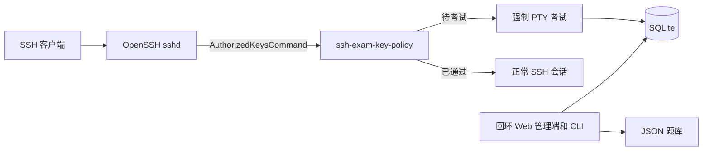

<div align="center">

# SSH Exam Gate

**让指定 SSH 公钥先完成知识考试，再获得服务器访问权限。**

[English](README.md) | [简体中文](README.zh-CN.md)

[](https://github.com/huluhuluu/ssh-exam/releases)
[](https://github.com/huluhuluu/ssh-exam/actions/workflows/release.yml)
[](LICENSE)
[](https://www.rust-lang.org/)

</div>

SSH Exam Gate 接入 OpenSSH 公钥查询流程。新用户先进入终端考试；通过后，重新
连接即可恢复普通 OpenSSH 行为。它适用于实验室、GPU 服务器、堡垒机等多人共享的
Linux 环境，用考试确认用户已经了解 SSH、Docker、网络拓扑或本机使用规范。

> [!IMPORTANT]
> 安装或启动 SSH Exam Gate **不会**修改正在运行的 `sshd`。只有运维人员安装、
> 校验并重载提供的 `Match Group` 配置后，拦截才会生效。必须保留一个不属于该组、
> 且已经验证可登录的恢复账号。

## 功能亮点

- **首次登录 TUI 考试**：拦截指定的 OpenSSH 公钥登录。
- **JSON 题库导入**：可分别维护宿主机、Docker、网络和通用知识题目。
- **组合测试**：保存和编辑多个草稿，配置题量及乱序规则，再发布不可变版本。
- **发布历史**：查看并重新启用旧版本，不修改其题目和审计记录。
- **安全的管理 CRUD**：通过 CSRF 防护和确认复选框修改、删除人员、未使用题库和
  未发布测试。
- **可搜索的管理列表**：人员可按账号/考试状态筛选，题库可按环境筛选，测试可按
  发布状态筛选；筛选结果使用可复制的 URL。
- **中英双语**：Web 与 TUI 支持英文、中文和双语模式。
- **人员直接绑定账号**：每个人员最多拥有一个 Unix 账号，所有启用公钥继承该账号；
  公钥注释和邮箱仅是标签。
- **通过后恢复普通 SSH**：Shell、远程命令、VS Code 和转发继续由现有 `sshd`
  配置控制。
- **回环管理界面**：Argon2id 密码、CSRF 防护、签名会话、题库原子写入。
- **Rust 小型二进制**：内置 SQLite，提供 Linux x86_64 预构建包。
- **一键生命周期管理**：校验发布包后安装/升级，安全卸载，以及显式确认后的完整清除。

## 工作原理



OpenSSH 把 `%u`、`%f`、`%t`、`%k` 交给 `ssh-exam-key-policy`。策略程序依次
核对 Unix 账号、公钥指纹、类型、内容、人员和当前测试版本，全部匹配后才输出一行
authorized-keys 规则；任何异常都默认拒绝。

待考试用户收到 `restrict,pty` 和强制执行的 `ssh-exam-tui` 命令；通过后策略只
返回登记的公钥，不再附加强制命令或转发限制，连接由现有 `sshd` 配置正常处理。

> [!WARNING]
> schema v5 已移除旧的逐密钥账号规则。升级时，仅当某个人员只有一个已启用旧账号，
> 且该账号未被其他人员共用，系统才会自动绑定；歧义数据保持“未分配”并默认拒绝登录。
> 升级前备份数据库，执行 `migrate` 后检查所有未分配人员，再重载 OpenSSH。

## 快速开始

预构建安装支持使用 glibc 的 Linux x86_64。安装脚本会下载发布包、校验 SHA256、
创建服务账号和受保护目录、安装示例与 sudoers 规则、初始化数据库和管理员密码，
并在 systemd 宿主机启动回环 Web 管理服务。

```sh
curl -fsSL https://github.com/huluhuluu/ssh-exam/releases/latest/download/ssh-exam | sudo sh -s -- --install
```

脚本通过 `/dev/tty` 两次读取新管理员密码，密码不会进入 Shell 历史或命令行参数。
再次执行同一命令即可升级二进制并执行迁移，同时保留配置、认证信息、数据库、题库、
人员、公钥、尝试记录和发布历史。

需要固定版本时：

```sh
VERSION=v0.4.8
curl -fsSL "https://github.com/huluhuluu/ssh-exam/releases/download/${VERSION}/ssh-exam" | sudo sh -s -- --install --release "$VERSION"
```

Docker 或其他非 systemd 环境由容器进程管理器负责运行管理端：

```sh
curl -fsSL https://github.com/huluhuluu/ssh-exam/releases/latest/download/ssh-exam | sudo sh -s -- --install --service-mode none
sudo ssh-exam --serve
```

无人值守部署可使用 `--admin-password-file FILE` 指向仅 root 可读的普通文件，安装后
立即删除该文件。已有安装不会读取或替换管理员密码。

统一命令**不会**编辑或重载 OpenSSH。需要人工审核的 SSH 与 sudoers 片段安装在
`/usr/share/doc/ssh-exam/deploy/`。复制 SSH `Match Group` 配置前，必须完成下文的
隔离测试和生产启用检查。

### 打开管理端

管理端拒绝非回环监听地址。通过 SSH 隧道访问：

```sh
sudo ssh-exam --start
ssh -p <SSH_PORT> -L 8787:127.0.0.1:8787 recovery-admin@bastion.example.org
```

打开 `http://127.0.0.1:8787/`，然后：

1. 在“题库”中导入或检查 JSON 题库；题库增多后可使用搜索和环境筛选。
2. 创建测试，通过复选框选择题库，然后发布。
3. 创建人员并进入人员详情页；日常管理时可按账号或考试状态筛选人员。
4. 为人员指定已有 Unix 账号，并登记一个或多个公钥。
5. 需要增加尝试次数时，在详情页重置当前考试。

创建人员和公钥本身不会启用拦截；该账号还必须命中提供的 OpenSSH
`Match Group` 配置。

### 修改管理员密码

```sh
sudo ssh-exam --set-admin-password
sudo ssh-exam --restart
```

第一条命令通过 `/dev/tty` 两次读取密码，原子替换认证文件并保留原有 UID/GID；密码不会
出现在 Shell 历史或进程参数中。无人值守轮换可传入
`--admin-password-file /root/admin-password`，完成后立即删除该文件。由外部进程管理器运行的
容器需要重启对应容器或进程，而不是再启动一个管理端实例。

### 统一管理命令

```sh
sudo ssh-exam --upgrade
sudo ssh-exam --migrate
sudo ssh-exam --set-admin-password
sudo ssh-exam --start
sudo ssh-exam --status
sudo ssh-exam --restart
sudo ssh-exam --stop
sudo ssh-exam --serve    # 供容器进程管理器使用的前台模式
ssh-exam --isolated --help
ssh-exam --version
```

`--install` 已负责首次初始化。只有自定义部署才需要传入 `--config`、`--admin-binary` 或
`--run-as`；`--runtime-dir` 和 `--log-file` 仅用于非 systemd 生命周期操作。每次调用只能
指定一个主操作。题库和测试的高级批量自动化仍由 `ssh-exam-admin` 子命令提供。

### 一键卸载或彻底清除

首先移除已审核的 SSH `Match Group`，校验完整 `sshd` 配置并重载 SSH。如果标准 SSH
配置路径仍引用 `ssh-exam-key-policy`，卸载脚本会拒绝删除二进制。

只删除程序文件，保留配置和所有运行数据：

```sh
sudo ssh-exam --uninstall
```

显式删除程序、配置、数据库、题库、服务身份和项目组：

```sh
sudo ssh-exam --purge --confirm-purge DELETE-SSH-EXAM
```

发布压缩包包含三个 Rust 二进制、统一命令、内部隔离 sshd helper、兼容安装脚本、通用配置/题库
示例、部署片段、许可证和中英文 README，不包含数据库、凭据、SSH 密钥、日志或机器专用配置。

## 题库

`quiz_path` 始终对应题库 ID `legacy`。配置 `quiz_directory` 后，其中安全的
`*.json` 文件名主干会成为额外题库 ID，例如 `host-ssh.json` 对应
`host-ssh`。

每个题库包含：

- 标题和描述性环境（`host`、`docker`、`network`、`general`）；
- 一道或多道选择题。

旧题库 JSON 仍可包含 `pass_threshold_percent` 和 `max_attempts`；组合时由测试设置
覆盖。Web 的“题库”页面可以校验 JSON 导入、查看/编辑题目并导出规范化 JSON。
写入使用同目录临时文件、同步和原子重命名。环境字段只是说明信息，不会访问
Docker、创建容器或执行命令。

## 测试与发布

测试包含稳定 ID、标题、有序题库 ID、通过分数、尝试次数、可选的每次考试题量，
以及独立的题目/选项乱序开关。系统可以同时保存多个草稿，并在详情页修改。发布时
会把所有题库解析成完整快照存入 SQLite，并根据测试身份、题库顺序、策略和题目
计算 SHA-256 revision。

- 编辑题库或草稿不会改变当前生效快照。
- 发布变化后的内容会启用新 revision，并要求重新通过。
- 重复发布等价内容会复用 revision。
- 尝试和通过记录都绑定测试 ID + revision。
- 发布历史不可变；重新启用旧版本时，该版本原有的通过资格会恢复。
- 测试使用复选框选择题库；已有选项会按照保存的组合顺序优先显示。

删除规则保持保守：删除人员只级联删除该人员的公钥和考试记录；被任意已保存测试
引用的题库不能删除；当前生效测试和已有发布历史的测试不能删除。

常用命令行操作：

```sh
ssh-exam-admin import-bank --config /etc/ssh-exam/config.json \
  --id host-ssh --file ./host-ssh.json
ssh-exam-admin list-banks --config /etc/ssh-exam/config.json
ssh-exam-admin create-test --config /etc/ssh-exam/config.json \
  --id onboarding --title 'Server onboarding' \
  --banks host-ssh,docker-ssh --pass-threshold 80 --max-attempts 3 \
  --question-limit 20 --shuffle-questions true --shuffle-choices true
ssh-exam-admin list-tests --config /etc/ssh-exam/config.json
ssh-exam-admin publish-test --config /etc/ssh-exam/config.json --id onboarding
ssh-exam-admin list-publications --config /etc/ssh-exam/config.json --id onboarding
ssh-exam-admin activate-publication --config /etc/ssh-exam/config.json \
  --id onboarding --publication-id <PUBLICATION_ID>
ssh-exam-admin show-published-test --config /etc/ssh-exam/config.json
```

## 先隔离测试，再改生产

统一命令会在调用者指定的运行目录下启动一个独立 `sshd`，并要求显式指定未占用
端口。命令通过 `exec` 进入内部 helper，不会额外保留包装进程，也不会编辑或重载
系统 SSH 配置。

```sh
ssh-exam --isolated dry-run \
  --runtime-dir <RUNTIME_DIR> \
  --port <TEST_PORT> \
  --test-user <UNIX_USER> \
  --app-config /etc/ssh-exam/config.json \
  --policy-binary /usr/local/libexec/ssh-exam-key-policy \
  --command-user ssh-exam-key

sudo ssh-exam --isolated background \
  --runtime-dir <RUNTIME_DIR> \
  --port <TEST_PORT> \
  --test-user <UNIX_USER> \
  --app-config /etc/ssh-exam/config.json \
  --policy-binary /usr/local/libexec/ssh-exam-key-policy \
  --command-user ssh-exam-key

ssh -p <TEST_PORT> -t <UNIX_USER>@127.0.0.1
sudo ssh-exam --isolated stop --runtime-dir <RUNTIME_DIR>
sudo ssh-exam --isolated cleanup --runtime-dir <RUNTIME_DIR>
```

在 Docker 中，容器内监听端口不会自动被其他机器访问。需要显式发布测试端口，
或者通过已有 SSH 连接建立端口转发。

## 生产启用

<details>
<summary>建议的文件所有者与权限</summary>

```text
/usr/local/libexec/ssh-exam-key-policy   root:root                  0755
/usr/local/libexec/ssh-exam-tui          root:root                  0755
/usr/local/sbin/ssh-exam-admin           root:root                  0755
/etc/ssh-exam/config.json                root:root                  0644
/etc/ssh-exam/admin-auth.json            ssh-exam-admin:root        0600
/var/lib/ssh-exam                        ssh-exam-admin:ssh-exam-db  2770
/var/lib/ssh-exam/quiz.json              ssh-exam-admin:ssh-exam-db 0640
/var/lib/ssh-exam/banks/*.json           ssh-exam-admin:ssh-exam-db 0640
/var/lib/ssh-exam/gate.db                ssh-exam-admin:ssh-exam-db 0660
```

策略账号需要读取数据库以及以后生成的 WAL/SHM 文件；TUI 和管理端需要写数据库；
只有管理端需要创建/重命名题库文件。不要给这些账号 Docker socket 权限或 Docker
组成员身份。

</details>

<details>
<summary>OpenSSH 启用检查清单</summary>

1. 保持一个恢复会话，并在真实 SSH 端口验证第二个恢复登录。恢复账号不能属于
   `ssh-exam-gated`。
2. 执行安装脚本并审核其安装的部署片段，再使用
   `visudo -cf /etc/sudoers.d/ssh-exam` 重新校验 sudoers 规则。
3. 通过管理端登记临时人员、其 Unix 账号和公钥，导入题库并发布临时测试。
4. 使用生产应用配置完整执行一次隔离测试。
5. 只把需要拦截的账号加入 `ssh-exam-gated`，再安装审核后的
   `deploy/sshd_config.snippet`。
6. 使用 `/usr/sbin/sshd -t` 校验完整配置，并运行
   `sshd -T -C user=<ACCOUNT>,host=bastion.example.org,addr=<CLIENT_IP>` 检查匹配结果。
7. 只重载、不重启系统 SSH。先测恢复账号，再测门禁账号；全程保留原恢复会话。

门禁不配置 `Port` 或 `ListenAddress`。只要对应监听器命中 `Match Group` 和
`AuthorizedKeysCommand`，任意 SSH 端口都可以使用。

</details>

<details>
<summary>回滚</summary>

从仍然打开的恢复会话中，把受影响用户移出 `ssh-exam-gated`，或移除门禁
`Match` 配置块。使用 `sshd -t` 校验完整配置后重载 SSH。连接不再命中该 Match
时，原有 `AuthorizedKeysFile` 行为恢复。

</details>

## VS Code Remote-SSH

VS Code 通常使用不分配 PTY 的 exec channel，因此不能指望它显示首次 TUI。
先在真实终端完成一次考试：

```sh
ssh -p <SSH_PORT> -t person-account@bastion.example.org
# 完成考试后，连接会关闭。
```

通过后，可照常使用 VS Code Remote-SSH。

## 安全模型

- 身份由请求的 Unix 账号和公钥 SHA256 指纹确定，公钥注释/邮箱不参与识别。
- 只有人员和公钥都启用，且请求的 Unix 账号与人员绑定账号完全一致时，策略程序
  才输出授权规则。
- 管理端仅监听回环地址，使用 Argon2id、登录失败限速、签名 HttpOnly Cookie、
  CSRF Token 和一次性签名提示。
- 通过状态属于人员和不可变测试版本；只有该 revision 仍为当前版本时，该人员所有
  已启用密钥才继承通过状态。
- 必须保留不受门禁控制的恢复账号。策略默认拒绝，因此数据库路径或权限错误会让
  被门禁控制的公钥登录失败。

## 构建与验证

使用当前稳定版 Rust 和仓库提交的 lockfile：

```sh
cargo fmt --all -- --check
cargo clippy --all-targets --all-features --locked -- -D warnings
cargo test --locked
cargo build --release --locked --bins
./scripts/validate-sshd.sh
visudo -cf deploy/sudoers.snippet
```

`scripts/pty-smoke.py` 检查终端启动和清理；
`scripts/benchmark-key-policy.py` 输出策略程序的中位数与 P95 延迟。

## 常见问题

| 现象 | 检查内容 |
|---|---|
| 未考试就进入正常 Shell | 有效 `Match Group`、组成员、人员绑定的 Unix 账号、通过状态、`%u/%f/%t/%k` 参数 |
| 公钥被拒绝 | 登记的指纹/密钥内容、启用状态、数据库权限和 SSH 日志中的默认拒绝错误 |
| VS Code 不显示 TUI | 在真实终端中先执行一次 `ssh -t` |
| 测试端口只能从 Docker 内访问 | 显式发布端口，或通过已有 SSH 连接转发 |
| 管理页面无法访问 | 保持回环监听并使用 `ssh -L`，不要直接公开管理端 |
| 题库保存失败 | 题库必须是普通文件；管理端需要写权限和同目录创建/重命名权限 |

## 许可证

[MIT](LICENSE)
