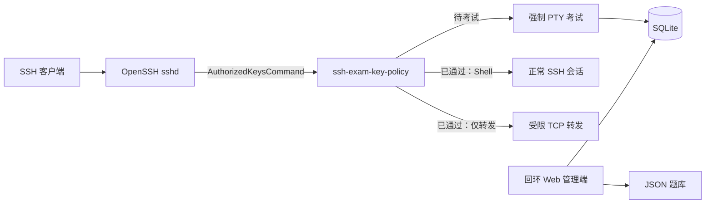

<div align="center">

# SSH Exam Gate

**让指定 SSH 公钥先完成知识考试，再获得服务器访问权限。**

[English](README.md) | [简体中文](README.zh-CN.md)

[](https://github.com/huluhuluu/ssh-exam/releases)
[](https://github.com/huluhuluu/ssh-exam/actions/workflows/release.yml)
[](LICENSE)
[](https://www.rust-lang.org/)

</div>

SSH Exam Gate 接入 OpenSSH 公钥查询流程。新用户先进入终端考试；通过后，再获得
管理员为其设置的访问权限。它适用于实验室、GPU 服务器、堡垒机等多人共享的
Linux 环境，用考试确认用户已经了解 SSH、Docker、网络拓扑或本机使用规范。

> [!IMPORTANT]
> 安装或启动 SSH Exam Gate **不会**修改正在运行的 `sshd`。只有运维人员安装、
> 校验并重载提供的 `Match Group` 配置后，拦截才会生效。必须保留一个不属于该组、
> 且已经验证可登录的恢复账号。

## 功能亮点

- **首次登录 TUI 考试**：拦截指定的 OpenSSH 公钥登录。
- **多文件题库**：可分别维护宿主机、Docker、网络和通用知识题目。
- **中英双语**：Web 与 TUI 支持英文、中文和双语模式。
- **公钥身份识别**：使用 Unix 账号 + SHA256 指纹；公钥注释和邮箱仅是标签。
- **两种通过后权限**：正常 SSH，或受严格限制的仅转发模式。
- **回环管理界面**：Argon2id 密码、CSRF 防护、签名会话、题库原子写入。
- **Rust 小型二进制**：内置 SQLite，提供 Linux x86_64 预构建包。

## 工作原理



OpenSSH 把 `%u`、`%f`、`%t`、`%k` 交给 `ssh-exam-key-policy`。策略程序依次
核对 Unix 账号、公钥指纹、类型、内容、人员和访问映射，全部匹配后才输出一行
authorized-keys 规则；任何异常都默认拒绝。

待考试用户收到 `restrict,pty` 和强制执行的 `ssh-exam-tui` 命令；通过后收到
访问映射所选择的权限。

## 通过后的访问模式

考试解决的是“**谁可以继续**”，访问模式解决的是“**通过后可以做什么**”。
这两个控制必须分开。

| 模式 | Shell / 命令 / PTY | TCP 转发 | 适用场景 |
|---|---:|---:|---|
| 正常 Shell | 按 `sshd` 配置允许 | 保持正常 SSH 行为 | 每人独立的 Linux 账号、交互终端、VS Code Remote-SSH |
| 仅转发（ProxyJump） | 禁止 | 只能访问精确的 `permitopen` 目标 | 多人共用的堡垒机跳板账号，不能获得堡垒机 Shell |

两种模式都必须先通过考试。如果所有用户都应该正常登录服务器，只创建
**正常 Shell** 映射即可，不必使用 ProxyJump 模式。

仅转发模式是最小权限设计：通过考试不代表一个共享跳板账号应当获得交互 Shell，
也不代表用户可以把堡垒机当作访问任意内网目标的隧道。

## 快速开始

### 1. 下载预构建版本

预构建包面向使用 glibc 的 Linux x86_64。其他架构或 glibc 不兼容时请从源码构建。

```sh
VERSION=v0.2.1
curl -fLO "https://github.com/huluhuluu/ssh-exam/releases/download/${VERSION}/ssh-exam-${VERSION}-linux-x86_64.tar.gz"
curl -fLO "https://github.com/huluhuluu/ssh-exam/releases/download/${VERSION}/SHA256SUMS"
sha256sum -c SHA256SUMS
tar -xzf "ssh-exam-${VERSION}-linux-x86_64.tar.gz"
```

压缩包只包含三个二进制、通用配置/题库示例、部署片段、许可证和中英文 README，
不包含数据库、凭据、SSH 密钥、日志或机器专用配置。

### 2. 准备配置

安装三个二进制，并把示例复制到运维人员管理的位置：

```text
ssh-exam-key-policy  OpenSSH 只读策略程序
ssh-exam-tui         强制执行的终端考试
ssh-exam-admin       数据库迁移和回环 Web 管理端
```

编辑 `config.example.json`，替换所有示例路径。`quiz_path` 是兼容旧版本的
`legacy` 题库；设置 `quiz_directory` 后可启用额外的 `*.json` 题库文件。

### 3. 初始化管理员密码

在目标机器上生成密码哈希。明文密码只从当前终端读取，不写入
`admin-auth.json`。

```sh
read -rsp 'Admin password: ' ADMIN_PASSWORD
printf '\n'
PASSWORD_HASH=$(printf '%s' "$ADMIN_PASSWORD" | \
  /usr/local/sbin/ssh-exam-admin hash-password)
unset ADMIN_PASSWORD

SESSION_SECRET=$(openssl rand -base64 32)
```

创建权限为 `0600` 的认证文件：

```json
{
  "password_hash": "<PASSWORD_HASH>",
  "session_secret_base64": "<SESSION_SECRET>",
  "session_ttl_seconds": 28800
}
```

用前面两个命令的输出替换占位符。不要直接部署
`examples/admin-auth.example.json`，其中的公开占位值并不安全。

- 修改管理员密码：重新生成哈希，只替换 `password_hash`，然后重启管理端。
- 强制所有已登录会话退出：同时重新生成 `session_secret_base64`。

### 4. 初始化并打开管理端

```sh
sudo -u ssh-exam-admin /usr/local/sbin/ssh-exam-admin migrate \
  --config /etc/ssh-exam/config.json

sudo -u ssh-exam-admin /usr/local/sbin/ssh-exam-admin serve \
  --config /etc/ssh-exam/config.json
```

管理端拒绝非回环监听地址。通过 SSH 隧道访问：

```sh
ssh -p <SSH_PORT> -L 8787:127.0.0.1:8787 \
  recovery-admin@bastion.example.org
```

打开 `http://127.0.0.1:8787/`，然后：

1. 创建人员。
2. 登记一个或多个公钥。
3. 为已有 Unix 账号创建访问映射。
4. 选择题库和通过后的访问模式。
5. 需要重新考试时，在 People 页面重置考试状态。

创建人员或访问映射仍然不会自动启用 OpenSSH 拦截。

## 题库

`quiz_path` 始终对应题库 ID `legacy`。配置 `quiz_directory` 后，其中安全的
`*.json` 文件名主干会成为额外题库 ID，例如 `host-ssh.json` 对应
`host-ssh`。

每个题库包含：

- 标题和描述性环境（`host`、`docker`、`network`、`general`）；
- 通过分数和最大尝试次数；
- 一道或多道选择题。

Web 的 Exam 页面可以创建题库，并编辑设置、题目、选项和答案。写入使用同目录
临时文件、同步和原子重命名。环境字段只是说明信息，不会访问 Docker、创建容器
或执行命令。

## 先隔离测试，再改生产

隔离脚本会在调用者指定的运行目录下启动一个独立 `sshd`，并要求显式指定未占用
端口。它不会编辑或重载系统 SSH 配置。

```sh
./scripts/isolated-sshd.sh dry-run \
  --runtime-dir <RUNTIME_DIR> \
  --port <TEST_PORT> \
  --test-user <UNIX_USER> \
  --app-config /etc/ssh-exam/config.json \
  --policy-binary /usr/local/libexec/ssh-exam-key-policy \
  --command-user ssh-exam-key

sudo ./scripts/isolated-sshd.sh background \
  --runtime-dir <RUNTIME_DIR> \
  --port <TEST_PORT> \
  --test-user <UNIX_USER> \
  --app-config /etc/ssh-exam/config.json \
  --policy-binary /usr/local/libexec/ssh-exam-key-policy \
  --command-user ssh-exam-key

ssh -p <TEST_PORT> -t <UNIX_USER>@127.0.0.1
sudo ./scripts/isolated-sshd.sh stop --runtime-dir <RUNTIME_DIR>
sudo ./scripts/isolated-sshd.sh cleanup --runtime-dir <RUNTIME_DIR>
```

在 Docker 中，容器内监听端口不会自动被其他机器访问。需要显式发布测试端口，
或者通过已有 SSH 连接建立端口转发。

## 生产启用

<details>
<summary>建议的文件所有者与权限</summary>

```text
/usr/local/libexec/ssh-exam-key-policy   root:root                  0755
/usr/local/libexec/ssh-exam-tui          root:root                  0755
/usr/local/sbin/ssh-exam-admin           root:root                  0755
/etc/ssh-exam/config.json                root:root                  0644
/etc/ssh-exam/admin-auth.json            ssh-exam-admin:root        0600
/var/lib/ssh-exam                        ssh-exam-admin:ssh-exam-db  2770
/var/lib/ssh-exam/quiz.json              ssh-exam-admin:ssh-exam-db 0640
/var/lib/ssh-exam/banks/*.json           ssh-exam-admin:ssh-exam-db 0640
/var/lib/ssh-exam/gate.db                ssh-exam-admin:ssh-exam-db 0660
```

策略账号需要读取数据库以及以后生成的 WAL/SHM 文件；TUI 和管理端需要写数据库；
只有管理端需要创建/重命名题库文件。不要给这些账号 Docker socket 权限或 Docker
组成员身份。

</details>

<details>
<summary>OpenSSH 启用检查清单</summary>

1. 保持一个恢复会话，并在真实 SSH 端口验证第二个恢复登录。恢复账号不能属于
   `ssh-exam-gated`。
2. 安装二进制、服务账号、配置、状态目录权限和检查后的 sudoers 规则。使用
   `visudo -cf deploy/sudoers.snippet` 校验。
3. 通过管理端登记一个临时人员、公钥、访问映射和题库。
4. 使用生产应用配置完整执行一次隔离测试。
5. 只把需要拦截的账号加入 `ssh-exam-gated`，再安装审核后的
   `deploy/sshd_config.snippet`。
6. 使用 `/usr/sbin/sshd -t` 校验完整配置，并运行
   `sshd -T -C user=<ACCOUNT>,host=bastion.example.org,addr=<CLIENT_IP>` 检查匹配结果。
7. 只重载、不重启系统 SSH。先测恢复账号，再测门禁账号；全程保留原恢复会话。

门禁不配置 `Port` 或 `ListenAddress`。只要对应监听器命中 `Match Group` 和
`AuthorizedKeysCommand`，任意 SSH 端口都可以使用。

</details>

<details>
<summary>回滚</summary>

从仍然打开的恢复会话中，把受影响用户移出 `ssh-exam-gated`，或移除门禁
`Match` 配置块。使用 `sshd -t` 校验完整配置后重载 SSH。连接不再命中该 Match
时，原有 `AuthorizedKeysFile` 行为恢复。

</details>

## VS Code Remote-SSH

VS Code 通常使用不分配 PTY 的 exec channel，因此不能指望它显示首次 TUI。
先在真实终端完成一次考试：

```sh
ssh -p <SSH_PORT> -t person-account@bastion.example.org
# 完成考试后，连接会关闭。
```

正常 Shell 映射通过后，可照常使用 VS Code Remote-SSH。仅转发映射需要先用
`ssh -t` 直接完成考试，再把该账号配置为 `ProxyJump`。

## 安全模型

- 身份由请求的 Unix 账号和公钥 SHA256 指纹确定，公钥注释/邮箱不参与识别。
- 只有人员、公钥和访问映射都启用时，策略程序才输出授权规则。
- 管理端仅监听回环地址，使用 Argon2id、签名 HttpOnly Cookie、CSRF Token 和
  一次性签名提示。
- 正常 Shell 用户名只能属于一个人；仅转发用户名可以共享，但禁止通配目标。
- 为兼容旧版本，通过状态目前属于人员；该人员所有已启用密钥和映射继承通过状态。
- 必须保留不受门禁控制的恢复账号。策略默认拒绝，因此数据库路径或权限错误会让
  被门禁控制的公钥登录失败。

## 构建与验证

使用当前稳定版 Rust 和仓库提交的 lockfile：

```sh
cargo fmt --all -- --check
cargo clippy --all-targets --all-features --locked -- -D warnings
cargo test --locked
cargo build --release --locked --bins
./scripts/validate-sshd.sh
visudo -cf deploy/sudoers.snippet
```

`scripts/pty-smoke.py` 检查终端启动和清理；
`scripts/benchmark-key-policy.py` 输出策略程序的中位数与 P95 延迟。

## 常见问题

| 现象 | 检查内容 |
|---|---|
| 未考试就进入正常 Shell | 有效 `Match Group`、组成员、访问映射、人员通过状态、`%u/%f/%t/%k` 参数 |
| 公钥被拒绝 | 登记的指纹/密钥内容、启用状态、数据库权限和 SSH 日志中的默认拒绝错误 |
| VS Code 不显示 TUI | 在真实终端中先执行一次 `ssh -t` |
| 测试端口只能从 Docker 内访问 | 显式发布端口，或通过已有 SSH 连接转发 |
| 管理页面无法访问 | 保持回环监听并使用 `ssh -L`，不要直接公开管理端 |
| 题库保存失败 | 题库必须是普通文件；管理端需要写权限和同目录创建/重命名权限 |

## 许可证

[MIT](LICENSE)
